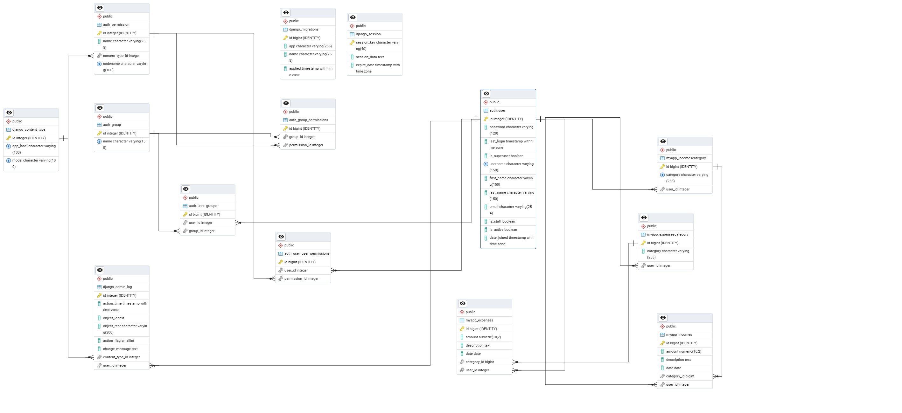

# SaveSpace

This project is a robust backend API designed to help users manage their personal finances effectively. Built with Django REST Framework, it provides a comprehensive set of functionalities for tracking income and expenses, categorizing transactions, generating financial summaries, and user management. The API is designed to be RESTful, making it easily integrable with various frontend applications (web, mobile, etc.).

## Table of Contents
- [Features](#features)
- [Architecture Diagram](#architecture-diagram)
- [Technologies](#technologies)
- [Installation and Setup](#installation-and-setup)
- [Diagram ERD](#diagram-erd)
- [Project Structure](#project-structure)
- [Authors](#autors)

## Features
**User Management:**
- User registration and authentication (login/logout).
- Retrieval and update of user profiles.
- Password change functionality.

**Category Management:**
- Creation, listing, and deletion of custom income categories.
- Creation, listing, and deletion of custom expense categories.

**Transaction Management:**
- Adding, listing, and deleting income records.
- Adding, listing, and deleting expense records.
- Filtering transactions by year and month for detailed insights.

**Financial Summaries:**
- Retrieval of monthly income, expense, and balance summaries.
- Monthly summaries of income and expenses grouped by category.

**Administrative Panel:**
- Comprehensive user management (listing, creation, update, deletion) accessible only to administrators.

**API Documentation:**
- Automatically generated interactive API documentation using drf-spectacular (Swagger UI) for easy API exploration and testing.


## Architecture Diagram
```
+-------------------+     +-------------------+     +-------------------+
|     Frontend      |     |      Backend      |     |     PostgreSQL    |
|    (React App)    |<--->|    (Django DRF)   |<--->|     (Database)    |
|    (Port: 5173)   |     |    (Port: 8000)   |     |    (Port: 5432)   |
+-------------------+     +-------------------+     +-------------------+
          ^                  
          |                    
          | (API Calls)      
          |                 
+-------------------+
|      pgAdmin      |
|  (DB Management)  |
|   (Port: 5050)    |
+-------------------+
```

## Technologies
- **Python 3.x:** A versatile and widely-used language, excellent for backend development due to its readability, extensive libraries, and strong community support.
- **Django 4.x:** A high-level Python web framework that encourages rapid development and clean, pragmatic design. Its "batteries-included" approach provides robust ORM, authentication, and admin panel, accelerating development.
- **Django REST Framework (DRF):** A powerful and flexible toolkit for building Web APIs on top of Django. It simplifies serialization, authentication, permissions, and viewsets, making API development efficient.
- **JWT Tokens (JSON Web Tokens):** Used for secure, stateless authentication in the API. JWTs allow for efficient authorization checks without requiring the backend to query a session database for every request, improving scalability and performance.
- **PostgreSQL:** A powerful, open-source object-relational database system known for its reliability, feature robustness (including advanced indexing, JSON support, and triggers), and strong compliance with SQL standards. Ideal for financial data where integrity is paramount.
- **React (Vite):** A popular JavaScript library for building user interfaces, chosen for its component-based architecture, declarative views, and large ecosystem. Vite is used as the build tool for its fast development server and optimized build process, significantly improving developer experience.
- **Docker & Docker Compose:** Essential for containerization, providing isolated and consistent development, testing, and production environments. Docker Compose orchestrates multi-container applications, simplifying setup and deployment.
- **drf-spectacular:** An OpenAPI 3.0 schema generation tool for Django REST Framework. It automatically generates interactive API documentation (Swagger UI), making API exploration and integration seamless for frontend developers.

## Intallation and Setup
1. Clone the repository:
``` git clone https://github.com/SzymXonX/ZTPAI_Home_Budget_App.git ```
2. Launch Docker Compose Service:
Build the Docker images and start all services (database, Django backend, pgAdmin, frontend):
``` docker-compose up --build ```
3. Apply Django Migrations and Create a Superuser (First-time setup):
After the containers are running, you need to apply Django database migrations and optionally create a superuser to access the Django admin panel and test admin-specific API endpoints.
``` 
docker exec -it ztpai2-backend-1 bash
python manage.py migrate
python manage.py createsuperuser
```

## Diagram ERD



## Project Structure
```

ZTPAI2/
├─ Backend/
│  ├─ db_init/
│  ├─ django_project/
│  │  ├─ __init__.py
│  │  ├─ asgi.py
│  │  ├─ settings.py
│  │  ├─ urls.py
│  │  └─ wsgi.py
│  ├─ myapp/
│  │  ├─ migrations/
│  │  ├─ templates/
│  │  ├─ __init__.py
│  │  ├─ admin.py
│  │  ├─ apps.py
│  │  ├─ models.py
│  │  ├─ serializers.py
│  │  ├─ tests.py
│  │  ├─ urls.py
│  │  └─ views.py
│  ├─ resolv.conf/
│  ├─ static/
│  ├─ .gitignore
│  ├─ Dockerfile
│  ├─ manage.py
│  └─ requirements.txt
├─ Frontend/
│  ├─ public/
│  ├─ src/
│  │  ├─ assets/
│  │  │  ├─ logo_bez_tla.png
│  │  │  ├─ logo.png
│  │  │  └─ react.svg
│  │  ├─ components/
│  │  │  ├─ Layout.jsx
│  │  │  ├─ LoadingIndicator.jsx
│  │  │  └─ ProtectedRoute.jsx
│  │  ├─ hooks/
│  │  │  └─ useTimedMessage.jsx
│  │  ├─ pages/
│  │  │  ├─ Admin.jsx
│  │  │  ├─ Categories.jsx
│  │  │  ├─ Home.jsx
│  │  │  ├─ Login.jsx
│  │  │  ├─ NotFound.jsx
│  │  │  ├─ Register.jsx
│  │  │  ├─ Settings.jsx
│  │  │  └─ Summary.jsx
│  │  ├─ styles/
│  │  │  ├─ Admin.css
│  │  │  ├─ Categories.css
│  │  │  ├─ Global.css
│  │  │  ├─ Home.css
│  │  │  ├─ LoginRegister.css
│  │  │  ├─ Navbar.css
│  │  │  ├─ Settings.css
│  │  │  └─ Summary.css
│  │  ├─ api.js
│  │  ├─ App.jsx
│  │  ├─ constants.js
│  │  └─ main.jsx
│  ├─ .dockerignore
│  ├─ .env
│  ├─ .gitignore
│  ├─ Dockerfile
│  ├─ eslint.config.js
│  ├─ index.html
│  ├─ package-lock.json
│  ├─ package.json
│  ├─ README.md
│  └─ vite.config.js
├─ .env
├─ .gitignore
├─ docker-compose.yml
├─ ERD.png
└─ README.md

```

## Autors
- Szymon Koczur
